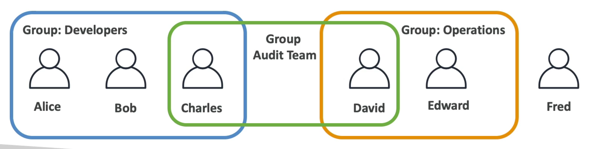
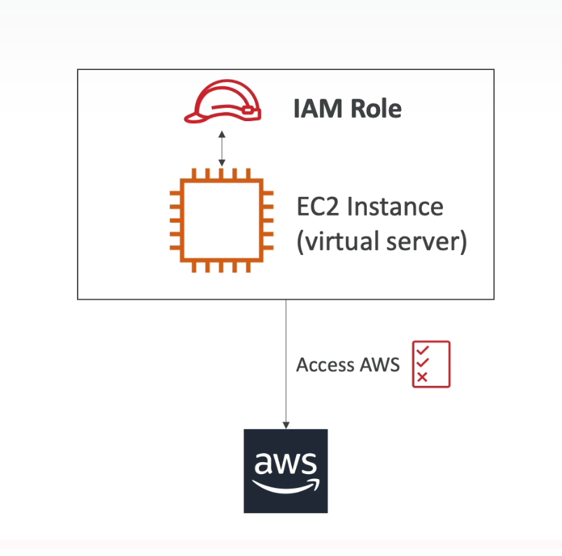
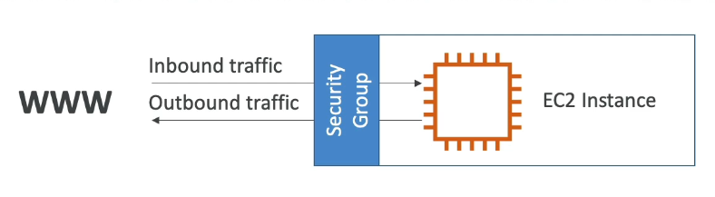
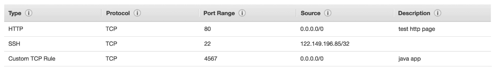
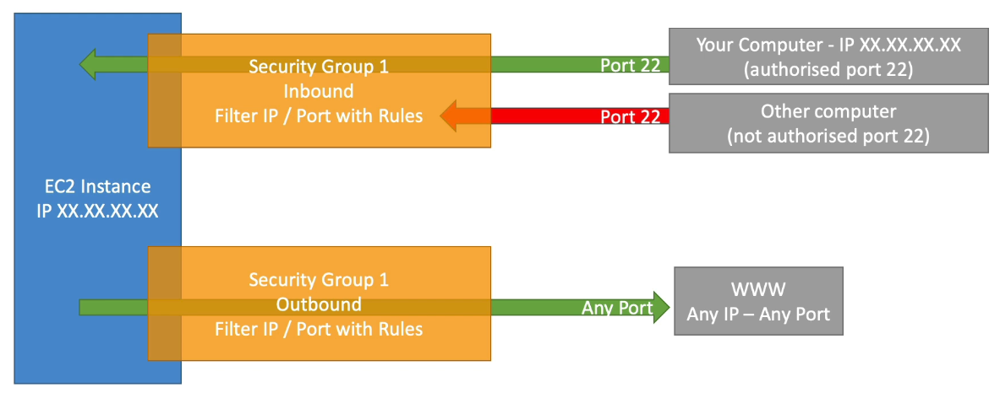
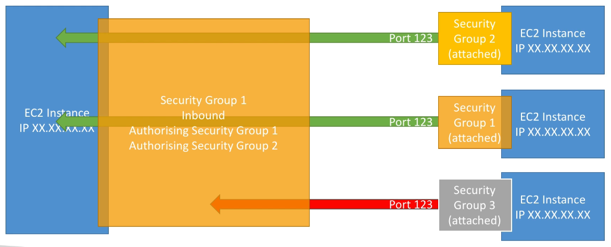

> [Udemy // Ultimate AWS Certified Solutions Architect Associate](https://www.udemy.com/course/aws-certified-solutions-architect-associate-saa-c02)  
> June 2021

[TOC]

# AWS Cloud Overview

## AWS Regions

- Regions all around the world
- Name can be us-west-2, eu-east-1...
- A regions is a cluster of data centers
- Most AWS services are region-scoped

### How to choose an AWS Region?

- **Compliance** with data governance and legal requirements: data never leave a regions without your explicit permission
- **Proximity** to customers: reduced latency
- **Available services** within a Region: new services and new features aren't available in every Region
- **Pricing** varies from region to region and is transparent in the service pricing page

## AWS Availability Zones

What is going into the region, usually around three with the minium being two and the maximum six.

Each availability zone (AZ) is one or more discrete data centers with redundant power, networking and connectivity, which are separate from other to isolate from disasters.

Availability Zones are connected with high bandwidth, ultra-low latency networking and they all make up the Region.

###AWS Points of Presence (Edge Locations)

- Amazon has 216 Points of Presence (205 Edge Locations & 11 Regional Caches) in 84 cities across 42 countries
- Content is delivered to end uses with lower latency

[More on AWS Regions and Availability Zones](https://aws.amazon.com/about-aws/global-infrastructure/regions_az/)

# IAM & AWS CLI

## Introduction

> IAM  
> Identity and Access Management which is a Global Service

Root account is created by default, used only to setup the account (create an admin account), but shouldn't be used after the fact or shared.

Instead we create Users within the organization which can be grouped. Groups can only contain users and not other groups, likewise, Users don't have to belong to a group and can belong to multiple groups.

<div align="center">
	
</div>

### Permissions

Users or Groups can be assigned JSON documents called **policies**

```json
{
	"Version": "2012-10-17",
	"Statement": [
		{
			"Effect": "Allow",
			"Action": "ec2:Describe*",
			"Resource": "*"
		},
		{
			"Effect": "Allow",
			"Action": [
				"cloudwatch:ListMetrics",
				"cloudwatch:GetMetricStatistics",
				"cloudwatch:Describe*"
			],
			"Resource": "*"
		}
	]
}
```

The policies define the permissions of the users. Never allow a user to do everything within AWS, isolate to what only the user needs, also called the **least privilege principle** in AWS.

Tags within AWS are used for categorization

## IAM Policies

Dictactes what the User/Group is allowed to do within AWS

### Structure

A JSON document that conists of:
- **Version**: policy language version, always include "2012-10-17"
- **Id**: an identifier for the policy (optional)
- **Statement**: one or more individual statements (required)
	- Consisting of:
		- **Sid**: an identifier for the statement (optional)
		- **Effect**: whether the statement allows or denies access (Allow, Deny)
		- **Principal**: account/role on which the policy is applied (ARN - Amazon Resource Name)
		- **Action**: list of actions this policy allows or denies
		- **Resource**: list of resources on which the actions will be applied
		- **Condition**: conditions for when this policy is in effect (optional)

```json
{
	"Version": "2012-10-17",
	"Statement": [
		{
			"Sid": "ReadWriteS3",
			"Effect": "Allow",
			"Principal": {
				[
					"AWS": [
						"arn:aws:iam::123456789012:root"
					]
				]
			},
			"Action": [
				"s3:GetObject",
				"s3:PutObject"
			],
			"Resource": [
				"arn:aws:s3:::myBucket/*"
			]
		}
	]
}
```

## IAM Multi-factor Authentication (MFA)

> Stronger the password; higher security for your account

Users/Groups should be protected from compromise by creating a **Password Policy** or **Multi-factor Authentication (MFA)**

### Password Policy
- Set a minimum password length
- Require specific character types
	- uppercase letters
	- lowercase letters
	- numbers
	- non-alphanumeric characters
	- etc..
 - Allow all IAM uses to change their own passwords
 - Require users to change their password after some time (password expiration)
 - Prevent password re-use

### Multi-factor Authentication (MFA)

> Multi-factor Authentication  
It's password you know plus a security device you own

Users can have access to your account and can change configurations or delete resources, so we want to protect the Root Accounts and IAM users.

Main benefit of MFA is that if a password is compromised the account is **NOT** compromised.

#### Device Options
- **Virtual MFA Device**
	- Support for multiple tokens on a single device
		- Google Authenticator (Phone Only)
		- Authy (Multi-Device)
- **Universal 2nd Factor (U2F) Security Key**
	- Support for multiple root and IAM users using a single security key 
  - Physical Device
  	- YubiKey by Yubico (3rd Party)
- **Hardware Key Fob MFA Device**
	- provided by Gemalto (3rd Party)
- **Hardware Key Fob MFA Device for AWS GovCloud (US)**
	- provided by SurePassID (3rd Party)

## Access Keys, CLI and SDK

> Access Keys are secret, like a password do not share them

There are three methods to access AWS:
- AWS Management Console (protected by password + MFA)
- AWS Command Line Interface (CLI): protected by access keys
	- Generated through the AWS Console
		- Access Key ID is like the username
		- Secret Access Key is like the password
	- Users manage their own access keys
- AWS Software Development Kit (SDK): for code and protected by access keys

AWS CLI is a tool that enables you to interact with AWS services using commands in your command-line shell. It is an open-source alternative to using the AWS Management Console that grants direct access to the public APIs of the AWS services.

AWS SDK stands for AWS Software Development Kit which is a set libraries for specific languages. It enables to access and manage AWS services programmatically which is embedded within your application supporting JavaScript, Python, PHP, .NET, Ruby, Java, Go, Node.js, C++; Mobile for Android and iOS; IoT Device like Embedded C, Arduino, etc...

## AWS CloudShell

> This feature is not available in all regions

A configurable CLI provided within AWS Management Console that allows you to make calls to the API along with its own repository that allows to download and upload files along with tabbed CLI support.

## IAM Roles for AWS Services

AWS services will need to perform actions on our behalf and this is where AWS Roles come into play to assign the permissions needed to the service(s).

Common Roles:
- EC2 Instance Roles
- Lambda Function Roles
- Roles for CloudFormation

<div align="center">
	
</div>

## IAM Security Tools

**IAM Credentials Report (account-level)**
A report that lists all your acount's users and the status of their various credentials.

**IAM Access Advisor (user-level)**
Shows the service permissions granted to a user and when those services were last accessed. With the gathered information it can be used to revise our policies.

## Best Practices

- Only use the root account to setup the AWS account
- One physical user is equal to one AWS user
- Assign users to groups and assign permissions to groups
- Create a strong password policy
- Use and enforce the use of Multi-factor Authentication (MFA)
- Create and use Roles for giving permissions to AWS services
- Use Access Key for Programmatic Access (CLI/SDK)
- Audit permissions of your account with the IAM Credentials Report
- **Never share IAM users and Access Keys**

## Summary

- **Users**: mapped to a physical user; has a password for AWS Console
- **Groups**: contains users only
- **Policies**: JSON document that outlines permissions for users or groups
- **Roles**: permissions for AWS services to make requests to AWS services
- **Security**: MFA + Password Policy
- **Access Keys**: access AWS using CLI or SDK
- **Audit**: IAM Credential Report & IAM Access Advisor

# EC2 Fundamentals

## Basics

> EC2  
> Elastic Compute Cloud

EC2 is one of the most popular of AWS' offerings that provides Infrastructure as a Service.

Consists in the capability of:
- Renting virtual machines (EC2)
- Storing data on virtual drives (EBS)
- Distributing load across machines (ELB)
- Scaling the services using an auto-scaling group (ASG)

**Knowing EC2 is fundamental to understand how the Cloud works**

### EC2 Sizing & Configuration Options

- Operating System (OS): Linux, Windows or MacOS
- How much compute power & cores (CPU)
- How much random-access memory (RAM)
- How much storage space:
	- Network-attached (EBS & EFS)
	- Hardware (EC2 Instance Store)
- Network Card: Speed of the card, Public IP Address
- Firewall Rules: **Security Group**
- Bootstrap Script (configure at first launch): EC2 User Data

### EC2 User Data

> Bootstrapping  
> Launching commands when a machine starts

It is possible to bootstrap our instances using an EC2 User Data script, which only runs once at the instance first start which runs with the root user (sudo).

EC2 User Data is used to automate boot tasks like:
- Installing updates
- Installing software
- Downloading common files from the internet
- Whatever pleases your heart <3

### EC2 Instance Types

There are a plethora of instance types and below is a sample size of five.

|  Instance   | vCPU | Mem (GiB) |     Storage      | Network Performance | EBS Bandwidth (Mbps) |
| :---------: | :--: | :-------: | :--------------: | :-----------------: | :------------------: |
|  t2.micro   |  1   |     1     |     EBS-Only     |   Low to Moderate   |                      |
|  t2.xlarge  |  4   |    16     |     EBA-Only     |      Moderate       |                      |
| c5d.4xlarge |  16  |    32     | 1 x 400 NVME SSD |    Up to 10 Gbps    |        4,750         |
| r5.16xlarge |  64  |    612    |     EBS Only     |       20 Gbps       |        13,600        |
| m5.8xlarge  |  32  |    128    |     EBA Only     |       10 Gbps       |        6,800         |

## EC2 Instance Types

### Overview

We can use different types of EC2 instances that are optimized for different use cases: [List of Instance Types](https://aws.amazon.com/ec2/isntance-types)

The AWS naming convention for the instances is as follows for example: `m5.2xlarge`
- **m**: instance class
- **5**: generation (AWS improves them over time)
- **2xlarge**: size within the instance class

### General Purpose

Great for diversity of workloads such as web server or code repositories which balances between **compute**, **memory** and **networking** resources.

### Compute Optimized

Great for compute-intensive tasks that require high performance processirs:
- Batch procesing workloads
- Media transcoding
- High performance web servers
- High performance computing (HPC)
- Scientific modeling & machine learning
- Dedicated gaming servers

### Memory Optimized

Gret for fast performance on workloads that process large data sets in memory:
- High performance, relational/non-relational databases
- Dsitributed web scale cache stores
- In-memory databases optimized for BI (business intelligence)
- Applications performing real-time processing of big unstructured data

### Storage Optimized

Great for storage-intensive tasks that require high, sequential read and write access to large data sets on local storage
- High frequency online transaction processing (OLTP) systems
- Relational & NoSQL databases
- Cache for in-memory databases (e.g. Redis)
- Data warehousing applications
- Distributed file systems

Tool for comparing EC2 instances: (EC2Instances.info)[https://instances.vantage.sh/]

## Security Groups & Classic Ports

### Introduction to Security Groups

Security Groups are the fundamental of network security in AWS that control how traffic is allowed into or out of our EC2 Instances.
- Security Groups only contain **allow** rules
- Security Groups rules can reference by IP or by security group

<div align="center">
	
</div>

### Deep Dive

Security Groups are acting as a "firewall" on our EC2 Instances and as such they regulate:
- Access to Ports
- Authorized IP ranges -- IPv4 and IPv6
- Control of inbound network (from outisde to the instance)
- Control of outbound network (from the instance to the outside)

<div align="center">
	
</div>

**Diagram**

<div align="center">
	
</div>

### Good to Know

- Can be attached to multiple instances
- Locked down to a region / VPC combination
- Lives "outside" of the EC2, where if traffic is blocked the EC2 instance won't see it
- **It's good to maintain one separate security group for SSH access**
- If your application is not accessible (timeout), then it's a security group issue
- If your application gives a "connection refuse" error; then it's an application error or it's not launched
- All inbound traffic is **blocked** by default
- All outbound traffic is **authorized** by default

### Referencing Other Security Groups

This is more advanced but it is a well established pattern when setting up load balancers, helps with not remembering a bunch of IP addresses.

<div align="center">
	
</div>

### Classic Ports

- **22**: SSH (Secure Shell) - log into a Linux instance
- **21**: FTP (File Transfer Protocol) - upload files into a file share
- **22**: SFTP (Secure File Transfer Protocol) - upload files using SSH
- **80**: HTTP - access unsecured websites
- **443**: HTTPS - access secured websites
- **3389**: RDP (Remote Desktop Protocol) - log into a Windows instance

## SSH Overview

MAke sure that private key files are protected so that it is not accessible by others, we do this by changing the key's permissions.

```sh
chmod 400 /path/to/private_key.pem
```

You can SSH into an EC2 instance by using the private key generated in AWS and making sure the instance has port 22 cofigured correctly for inbound traffic. Once that is done you can then access an EC2 instance (AMI) via SSH like so:

```sh
ssh -i /path/to/private_key.pem ec2-user@IP_ADDRESS
```

## EC2 Instance Roles Demo

