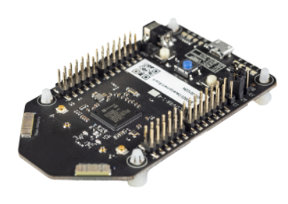

> [Azure Fundamentals Part 3: Describe Core Solutions and Management Tools in Azure](https://docs.microsoft.com/en-us/learn/paths/az-900-describe-core-solutions-management-tools-azure/)
> Microsoft Learn

[TOC]

# Choose the Best Azure IoT Service for your Application

## Identify the Product Options

IoT enables devices to gather and then relay information for data analysis. 
Commons sensors

* * Environmentsl sensors that capture temperature and humidity levels
* Barcode, QR code, OCR (optical character recognition) scanners
* Geo-location and proximity sensors
* Ligh, color and ifrared sensors
* Sounds and ultrasonic sensors
* Motion and touch sensors
* Accelerometer and tilt sensors
* Smoke, gas and alcohol sensors
* Error sensors to detect when there's a problem with the device
* Mechanical sensors that detect anomalies or deformations
* Flow, level and pressure sensors for measuring gasses and liquids

Devices can send their readings to a specific endpoint on Azure IoT via a message. CAn update devices with new firmware by sending software updates from Azure IoT to each device.

Suppose we manufacture a smart vending machine, we'd like to collect information like:
* Each machine operating without errors?
* Have they been compromised?
* Is the refrigreration system working as intended?
* Item stock levels

Sending the above information as a message to Azure IoT can be received, stored, organized and displayed but can also be combined with Azure AI services to help predict:
* When maintenance may be required
* When inventories will need to be replenished

### Azure IoT Hub

Acts as a central message hub for bi-directional communication between IoT application and the devices it manages. Device agnostic so the sky is the limit.

Supports communication from the device to the cloud and from the cloud to the device and supporting multiple messaging patterns like device-to-cloud telemetry, file upload from devices and request-reply methods. IoT hub can route the messages received to other Azure services.

### Azure IoT Central

Builds on top of IoT Hub by adding a dashboard to connect, monitor and manage IoT devices. Can watch overall performance across all devices in aggregrate and can set up alerts that send notifications when devices need maintenance and also being able to push firmware updates.

Providing common scenario templates across different industries to quickly be up and running. Can manage devices remotely via the UI but the key part of IoT Central is the use of device templates. Connect a device without any service-side coding to construct the dashboards, alerts and so forth though developers still need to create the code to run on the devices and must match the template specification.

### Azure Sphere

Creates end-to-end, highly secure IoT solution for customers that encompasses everything from hardware and OS on the device to the secure method of sending messages to the hub.

	
	

		<small>Seeed Azure Sphere MT3620 Development Kit MCU</small>
	

* Comes with a micro-controller unit (MCU) which processes the OS and signals from the attached sensors. 
* Custom Linux OS that handles communication with the security service and run the vendor's software
* Azure Sphere Security Service (AS3) which is responsible for ensuring the device has not been compromised. Authenticates itself with Azure via certificate-based authentication.

## Analyse the Decision Criteria

Understanding criteria needed can help in making the decision for which IoT service to use.

### Is it critical to ensure that the device is not compromised?

Not all cases, though it would be nice not to be compromised nefariously, but as an example a washing machine wouldn't need to be as security oriented as an ATM.

If security is critical, the best option would be Azure Sphere, which provides a comprehensive end-to-end solution for IoT devices. Ensuring a secure channel of communication between the device and Azure by having control of the hardware, OS and authentication process.

### Do I need a dashboard for reporting and management?

If the end goal is to receive telemetry data and push occasional updates then Azure IoT Hub will be great by itself and can offset management tools and reports to developers via the IoT Hub RESTful API.

If it's a pre-built customizable UI that lets you control devices remotely, then Azure IoT Central is the service needed. Which integrates with IoT Hub to create a reporting dashboard and management.

# Choose the Best AI Service for your Needs

## Identify the Product Options

AI is a broad classification of computing that allows a software system to perceive its environment and rtake action that maximizes is chance of successfully achieving its goals, being able to adapt or learn something on its own.

First approach is employing *deep learning* that's modeled after a human minds neural network to self discover, learn and grow through experience.

Second approach is *machine learning*, which is a data science technique that uses existing data to train a model, test it and apply the model to new datato forecast behaviors, outcomes and trends.

Forecasting and predicting from machine learning can make devices / software smarter, like recommending products to you on an e-commerce platform based on your shopping history and others who've bought similar products.

## Azure Product Options

Azure offers three primary products designed for specific use-cases.

### Azure Machine Learning

A platform for making predictions and consists of tools and service that connects to data to train and test models. Once trained it can be deployed and used via web API endpoints.

* * Allows to define a process for obtaining data and handling missing/corrupted data, split it into a training set or test set and deliver it to the training process
* Use programming languages used by data scientists to train and evaluate predictive models
* Ability to create pipelines based on training / test data that define when and where to run the experiments to score the algorithm
* Deploy the algorithm as an API to be consumed in real time by other applications

Ideal when complete control over the design and training of an algorithm is required.

### Azure Cognitive Services

Prebuilt machine learning models that enable applications to see, hear, speak, understand and even begin to reason (*0*). Useful for solving general problems like analyzing text for emotional sentiment or images to recognize objects / faces with no knowledge of special machine learning or data science. Developers can include these features via an API in a few lines of code to use pretrained models on live data.

Azure Cognitive Services categories:

* Language services: Allows the process of natural language to evaluate sentiment to learn and recognize user wants via a prebuilt script
* Speech services: Convert speech to text and text to natural-sounding speech (scary), translation and speaker verification and recognition
* Vision services: Recognition and identification capabilities on images, videos and other visual content
* Decision services: Personalized recommendations for users that automatically improves through use, moderate and monitor content and remove derogatory content and abnormalities in time series data

### Azure Bot Service / Bot Framework

Platforms for creating virtual agents that understand and reply to questions just like a human.
( ͡ಠ ʖ̯ ͡ಠ)
Its use case is to create a virtual agent to communicate with humans using other Azure services like Azure Cognitive Services to understand what the human is asking. Put the bots to handle menial tasks (this is how the uprising begins) like taking a dinner reservations and automate the process.

## Analyze the Decision Criteria

### Are you building a virtual agent that interfaces with humans via natural language?

Use Azure Bot Service when a virtual agent is needed to interact with humans using natural language.

### Do you need a service that can understand the content and meaning of images, video, or audio, or that can translate text into a different language?

Use Azure Cognitive Services for general purpose tasks, like text to speech, integrating with search or object identification. Benefit from the work Microsoft already did to train and test the models needed.

