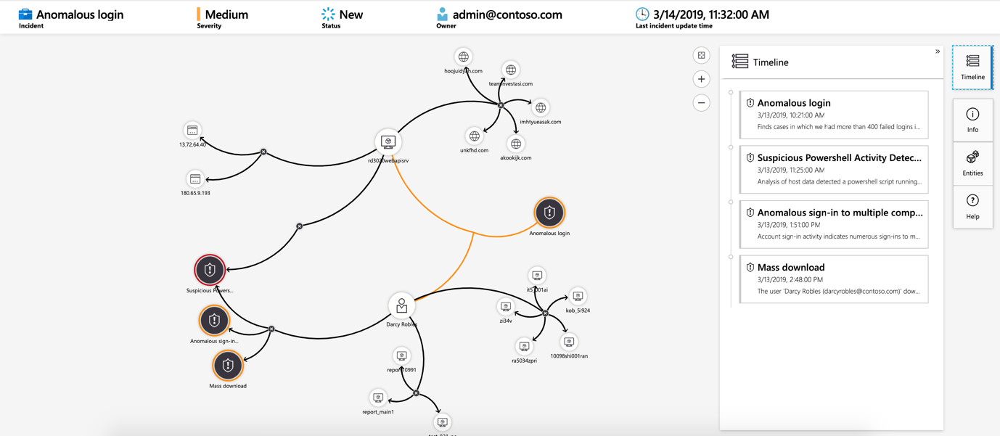
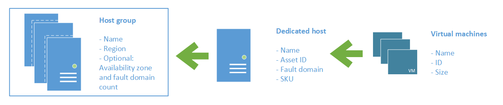

> [Azure Fundamentals Part 4: Describe General Security and Network Security Features](https://docs.microsoft.com/en-us/learn/paths/az-900-describe-general-security-network-security-features/)  
> Microsoft Learn

[TOC]

# Protect Against Security Threats on Azure

Security, a small word for a significant concept with so many factors to consider in order to protect your applications and data.

## Protect Against Security Threats by Using Azure Security Center

### What's Azure Security Center

A monitoring service that provides visibility of your **security posture** across all of your services, be it on Azure or on-premises.

> Security Posture  
> Refers to cybesecurity policies and controls and how well security threats can be predicted, prevented and responded

* Monitor security acorss on-premises and cloud
* Apply required security settings as new resources come online, automatically
* Security recommendations based on current configs, resources and networks
* Continuous resource monitoring and automatic security assessments to identify potential vulnerabilities before they can be exploited
* Detect and block malware from being installed on VMs and other resources using machine learning
* Adaptive controls to define allowed applications
* Detect and analyze potential inbound attacks and investigate threats and any post-breach activity that might have occurred.
* Provide just-in-time access control for network ports. 

### Understand Your Security Posture

Resources are analyzed against security controls of any governance policy assigned, viewing overall regulatory compliance from a security perspective from one place.

	
	
<small>Azure Security Center</small>

Say we want to comply with the Payment Card Industry's Data Security Standard (PCI DSS), the above report demonstrates not all resources are up to par.

**Resource security hygience** is a section that details resource health from a security perspective and recommendations are categorized as low, medium and high.

	
	
<small>Resource Security Hygience</small>

#### What's Secure Score?

A measurement of an organization's security posture, based on the percentage of security controls (groups of related security recommendations) satisfied. Remediating all recommendations within a single resource wtihin a control improves the score.

Azure Security Center has a centralized dashboard for monitoring and working on Azure resource security like identities, data, apps, devices and infrastructure.

Secure score helps you:

* Report on the current state of your organization's security posture.
* Improve your security posture by providing discoverability, visibility, guidance, and control.
* Compare with benchmarks and establish key performance indicators (KPIs).

### Protect Against Threats

Security Center has defense capabilities for VMs, network security and file integrity.

* **Just-in-Time VM Access**  
Blocks traffic by default to specific network ports of VMs, but allows traffic for a specified time when an admin requests and approves it.
* **Adaptive Application Controls**  
Control which applications are allowed to run on VMs. Machine learning is used in the background by Security Center to look at running processes within the VM. Creates exception rules for each resource group that holds the VMs and provides recommendations.
* **Adaptive Network Hardening**  
Monitor and compare VM internet traffic to patterns with the orgs current network security group (NSG) settings. Which can generate recommendations whether NSGs should be further locked down.
* **File Integrity Monitoring**  
Configure monitoring for changes on important files, registry settings, applications and other aspects that may indicate a security risk

### Respond to Security Alerts

Able to have a centralized view of security alerts with the ability to dismiss false alerts, investigate further, remediate alerts manually or use an automated response with _workflow automation_. 

Workflow automation uses Azure Logic Apps and Security Center connectors to trigger by a threat detection alert or Security Center recommendation. Can configure the logic app to run an action like send an email or post a message to a Microsoft Teams channel (I prefer Slack).

## Detect and Respond to Security Threats by Using Azure Sentinel

Large scale security management can benefit from a dedicated security information and event management (SIEM) system, which aggregates security data from different sources that support an open-standard logging format.

### Azure Sentinel capabilities

Azure Sentinel is Microsoft cloud-based SIEM.

* **Collect cloud data at scale**  
Collect data across all users, devices, applications and infrastructure (on-premise / cloud)
* **Detect previously undetected threats**  
Minimize false positives by using Microsoft's comprehensive analytics and threat intellifence
* **Investigate threats with artificial intelligence**  
Examine suspicious activities at scale, tapping into years of cybersecurity experience from Microsoft
* **Respond to incidents rapidly**  
Use built-in orchestration and automation of common tasks

### Connect Your Data Sources

Can analyze data sources for security events and the connections are handled by built-in connectors or industry-standard log formats and APIs.

* **Connect Microsoft Solutions**  
Connectors provide real-time integration for services like Microsoft Theat Protection solutions, Microsoft 365 sources, Azure Active Directory and Windows Defender Firewall.
* **Connect Other Services and Solutions**  
Connectors are available for common non-Microsfot services and solutions, including AWS CloudTrail, Citrix Analytics (Security), Sophos XG Firewall, VMWare Carbon Black Cloud and Okta SSO.
* **Connect Industry-Standard Data Sources**  
Support for data from other sources that use the Common Event Format (CEF) messaging standard, Syslog or REST API.

### Detect Threats

Templates designed by Microsoft's team of security experts and analysts on known threats, common attack vectors and escalation chains for suspicious activity is what ultilizes built in analytics. Templates can be customized to search for any activity that look suspicious with some templates using machine learning behavioral analytics based on Microsoft's proprietary algorithms.

### Investigate and Respond

Azure Sentinel has an investigation graph that an organization can use to review information when suspicious events are detected.

	
	
<small>Investigation Graph</small>

Azure Monitor Playbook can be used to automate responses to threats, like setting an alert that looks for malicious IP address that access the network and create a workbook that executes the following when triggered:

1. Open a ticket in the IT ticketing system
2. Send a message to the security operations channel in Microsoft Teams/Slack for awareness
3. Send all the alert information to the senior network admin and security admin via an email containing two option buttons: **Block** or **Ignore**

When **Block** is chosen, the IP address is blocked in the firewall and the user disabled in Azure Active Directory.
When **Ignore** is chosen, the alert is closed in Azure Sentinel and in the IT ticketing system.

## Store and Manage Secrets by Using Azure Key Vault

Azure Key Vault is a centralized cloud service for storing an application's secrets in a single, central location with secure access with access control and logging capabilities.

### What can Azure Key Vault do?

* **Manage Secrets**  
You can use Key Vault to securely store and tightly control access to tokens, passwords, certificates, API keys, and other secrets.

* **Manage Encryption Keys**  
You can use Key Vault as a key management solution. Key Vault makes it easier to create and control the encryption keys that are used to encrypt your data.

* **Manage SSL/TLS Certificates**  
Key Vault enables you to provision, manage, and deploy your public and private SSL/TLS certificates for both your Azure resources and your internal resources.

* **Store Secrets Backed by Hardware Security Modules (HSMs)**  
These secrets and keys can be protected either by software or by FIPS 140-2 Level 2 validated HSMs.

### What are the Benefits of Azure Key Vault?

* **Centralized Application Secrets**  
Centralizing the storage for your application secrets enables you to control their distribution, and reduces the chances that secrets are accidentally leaked.

* **Securely Stored Secrets and Keys**  
Azure uses industry-standard algorithms, key lengths, and HSMs. Access to Key Vault requires proper authentication and authorization.

* **Access Monitoring and Access Control**  
By using Key Vault, you can monitor and control access to your application secrets.

* **Simplified Administration of Application Secrets**  
Key Vault makes it easier to enroll and renew certificates from public certificate authorities (CAs). You can also scale up and replicate content within regions and use standard certificate management tools.

* **Integration with Other Azure Services**  
You can integrate Key Vault with storage accounts, container registries, event hubs, and many more Azure services. These services can then securely reference the secrets stored in Key Vault.

## Host Your Azure Virtual Machines on Dedicated Physical Servers by Using Azure Dedicated Host

VMs run on shared hardware that Microsoft manages, although the hardware is shared the workloads are isolated.

In some cases regulatory compliance requires organizations to be the only customer using the physical machine that hosts their VMs, and that's where Azure Dedicated Host comes into play.

A _dedicated_host_ is mapped to a physical server in an Azure datacenter.
A _host_group_ is a collection of dedicated hosts.

	
	
<small>Dedicated Hosts / Host Groups</small>

### What are the Benefits of Azure Dedicated Host?

* Gives you visibility into, and control over, the server infrastructure that's running your Azure VMs.
* Helps address compliance requirements by deploying your workloads on an isolated server.
* Lets you choose the number of processors, server capabilities, VM series, and VM sizes within the same host.

### Availability Considerations for Dedicated Host

For high availability, multiple hosts can be provisioned in a host group, and deploy VMs across this group. VMs on dedicated hosts can also take advantage of maintenance control a feature enabling to control when regular maintenance updates occur, within a 35-day rolling window.

### Pricing Considerations

Charged per dedicated host, independent of how many VMs are deployed to it, price is based on the VM family, type (hardware size) and region.

Software licensing, storage and network usage are billed separately from the host and VMs.

# Secure Network Connectivity on Azure

## What is Defense in Depth?

Protect information and precent it from being stolen by those who aren't authorized to access it, by using a series of mechanisms to slow the advance of an attack.

